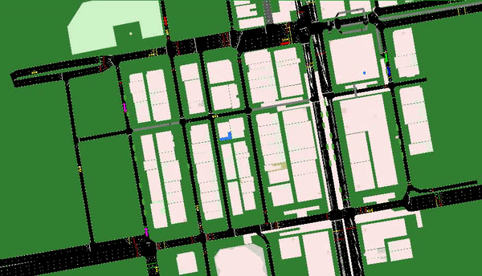

# Traffic_scenario_construction
A semi-realistic simulation of the traffic scenario in Mong Kok district in Hong Kong.

### You can play with this traffic scenario by installing SUMO.
If you run debian or ubuntu, SUMO is part of the regular distribution and can be installed like this:

sudo apt-get install sumo sumo-tools sumo-doc

